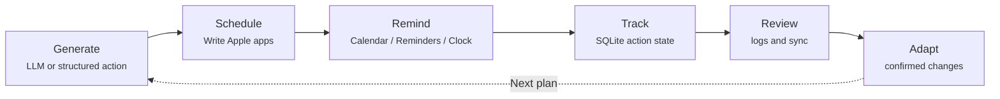
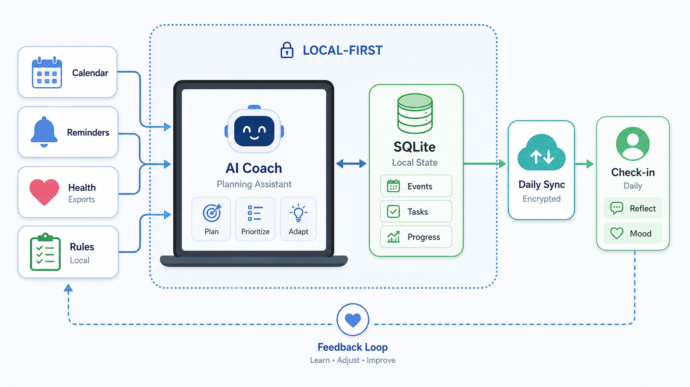

<p align="center">
  <h1 align="center">Nudge</h1>
  <p align="center">
    Local-first macOS automation for plans that actually reach Apple apps
    <br />
    <strong>Plan · Schedule · Remind · Track · Adapt</strong>
    <br />
    <br />
    <a href="README.zh-CN.md">Chinese documentation</a> · <a href="https://github.com/Zenine/nudge/issues">Report Bug</a> · <a href="https://github.com/Zenine/nudge/issues">Request Feature</a>
  </p>
</p>

<p align="center">
  <a href="https://github.com/Zenine/nudge/stargazers"></a>
  <a href="https://www.python.org/"></a>
  <a href="https://github.com/Zenine/nudge/issues"></a>
</p>

<p align="center">
  
</p>

[Chinese documentation](README.zh-CN.md)

Nudge is a local-first macOS CLI runtime that turns structured requests or natural-language plans into Apple Calendar, Reminders, Notes, and Clock actions.

This public repository contains the reusable runtime, CLI, Apple adapters, daemon, MCP wrapper, and installation scripts. Personal plans, local configuration, private state, API keys, Health exports, and user-specific documents are intentionally not included.

## Reader Paths

| If you are | Start with |
|------------|------------|
| Trying Nudge for the first time | [Quick Start](#quick-start) |
| Setting up a Mac | [Installation](#installation), [Configuration](#configuration), [Diagnostics and Repair](#diagnostics-and-repair) |
| Calling Nudge from another AI agent | [Agent and MCP](#agent-and-mcp) |
| Maintaining the project | [Development and Verification](#development-and-verification), [Project Layout](#project-layout) |

Rule of thumb: natural-language input goes through `nudge do` or the root command; already-structured actions go through `nudge agent apply` or MCP and skip the LLM.

## Feature Overview

- Parse natural-language plans into calendar events, reminders, notes, and alarms.
- Preview writes with `--dry-run` before touching Apple apps.
- Expose structured Agent JSON and a local MCP stdio server for safe automation.
- Store actions, plans, habits, health summaries, daemon queue rows, and run results in local SQLite.
- Use local adapter contracts for Apple Calendar, Reminders, Notes, and Clock.
- Support Anthropic, OpenAI-compatible APIs, DeepSeek, Qwen/DashScope, and Ollama.

## What It Does



<p align="center">
  
</p>

## Requirements

- macOS.
- Python 3.12+.
- Permissions for Apple Calendar, Reminders, Notes, and Shortcuts.
- At least one usable LLM provider. The default configuration uses Qwen/DashScope.
- To create alarms, a Shortcuts bridge named `Nudge Create Alarm` is required.

## Quick Start

```bash
git clone https://github.com/Zenine/nudge.git nudge-public
cd nudge-public
scripts/bootstrap_mac.sh
nudge doctor
nudge --dry-run "Project sync tomorrow at 3pm"
```

`scripts/bootstrap_mac.sh` creates a project-local `.venv` and initializes `config.toml` from `config.example.toml` when it does not exist.

## Installation

Use the macOS bootstrap script:

```bash
scripts/bootstrap_mac.sh
```

The script:

- checks the Python version;
- creates a project-local `.venv`;
- installs `requirements.txt`;
- creates `config.toml` from `config.example.toml` if needed;
- installs the `nudge` command;
- optionally runs `nudge doctor`.

You can also run the repository-local entrypoint without installing to `PATH`:

```bash
bin/nudge --help
bin/nudge doctor
```

## Configuration

Create local configuration from the example:

```bash
cp config.example.toml config.toml
```

Minimal configuration:

```toml
[general]
default_calendar = "Personal"
default_reminder_list = "Tasks"
locale = "en-US"

[state]
dir = "~/.local/share/nudge"

[llm]
provider = "qwen"
secrets_path = "~/.config/nudge/secrets.yaml"

[llm.models]
fast = "qwen-plus"
default = "qwen-plus"
strong = "qwen-plus"
```

`secrets_path` should point to a private file owned by the deployment user. The default path is `~/.config/nudge/secrets.yaml`. You can also override it with `NUDGE_SECRETS_PATH` or `EMAIL_SECRETS_PATH`. Never store secrets in the repository.

API key resolution order:

1. `config.toml [llm].api_key`
2. provider-specific environment variables
3. `secrets_path`
4. `LLM_API_KEY`

For long-running deployments, prefer environment variables or `secrets_path` over inline `api_key`.

### Apple Defaults

The default Apple targets are configured in `config.toml`:

```toml
[general]
default_calendar = "Personal"
default_reminder_list = "Tasks"
default_notes_folder = "Nudge"

[apple.clock]
backend = "shortcuts"
shortcut_name = "Nudge Create Alarm"
```

Create matching Calendar, Reminders list, and Notes folder names on the target Mac, or change these values to match existing local names.

Common environment variables:

```bash
export DASHSCOPE_API_KEY="<your DashScope key>"
export OPENAI_API_KEY="<your OpenAI key>"
export ANTHROPIC_API_KEY="<your Anthropic key>"
```

`secrets.yaml` uses simple top-level key/value entries:

```yaml
dashscope_api_key: "<your DashScope key>"
openai_api_key: "<your OpenAI key>"
anthropic_api_key: "<your Anthropic key>"
deepseek_api_key: "<your DeepSeek key>"
```

## LLM Providers

Nudge reads LLM settings from `config.toml [llm]` and `[llm.models]`. `provider` chooses the API family. `fast`, `default`, and `strong` can use separate models for lightweight parsing, normal chat, and heavier planning.

### Qwen/DashScope

Default configuration:

```toml
[llm]
provider = "qwen"
secrets_path = "~/.config/nudge/secrets.yaml"

[llm.models]
fast = "qwen-plus"
default = "qwen-plus"
strong = "qwen-plus"
```

Supported key sources:

- environment: `DASHSCOPE_API_KEY` or `QWEN_API_KEY`
- `secrets.yaml`: `dashscope_api_key` or `qwen_api_key`

`provider = "dashscope"` is an alias for `qwen`.

### OpenAI

```toml
[llm]
provider = "openai"
secrets_path = "~/.config/nudge/secrets.yaml"

[llm.models]
fast = "gpt-4.1-mini"
default = "gpt-4.1"
strong = "gpt-4.1"
```

Supported key sources:

- environment: `OPENAI_API_KEY`
- `secrets.yaml`: `openai_api_key`

For an OpenAI-compatible gateway, set `base_url`:

```toml
[llm]
provider = "openai"
base_url = "https://your-compatible-endpoint/v1"
```

### Anthropic

```toml
[llm]
provider = "anthropic"
secrets_path = "~/.config/nudge/secrets.yaml"

[llm.models]
fast = "claude-haiku-4-5-20251001"
default = "claude-sonnet-4-20250514"
strong = "claude-sonnet-4-20250514"
```

Supported key sources:

- environment: `ANTHROPIC_API_KEY`
- `secrets.yaml`: `anthropic_api_key`

### DeepSeek

```toml
[llm]
provider = "deepseek"
secrets_path = "~/.config/nudge/secrets.yaml"

[llm.models]
fast = "deepseek-chat"
default = "deepseek-chat"
strong = "deepseek-chat"
```

Supported key sources:

- environment: `DEEPSEEK_API_KEY`
- `secrets.yaml`: `deepseek_api_key`

### Ollama

Ollama is useful for local or private-network deployments and does not need an API key. Start Ollama first:

```bash
ollama serve
```

Configuration:

```toml
[llm]
provider = "ollama"
base_url = "http://localhost:11434/v1"

[llm.models]
fast = "llama3.1"
default = "llama3.1"
strong = "llama3.1"
```

## Diagnostics and Repair

Run diagnostics first:

```bash
nudge doctor
```

Machine-readable output:

```bash
nudge doctor --json
```

Common fixes:

- `Config file not found`: run `cp config.example.toml config.toml`, or pass `--config <path>`.
- Missing API key: set the provider-specific environment variable, or point `config.toml [llm].secrets_path` to the deployment user's private `secrets.yaml`.
- Calendar permission failure: open macOS System Settings -> Privacy & Security -> Calendars, then grant the shell host app Full Calendar Access where macOS offers separate access levels.
- Reminders permission failure: open System Settings -> Privacy & Security -> Reminders, then allow Terminal, iTerm, Python, or the app that runs Nudge.
- Notes / Mail Automation failure: open System Settings -> Privacy & Security -> Automation, then allow the shell host app to control Notes or Mail.
- Alarm creation failure: confirm that Shortcuts contains `Nudge Create Alarm`, or set the real shortcut name in `config.toml [apple.clock].shortcut_name`.
- `nudge` command not found: try `bin/nudge --help`; if it works, add `~/.local/bin` to `PATH`.

## Runtime Logs

Nudge writes user-repairable warnings and errors to a local JSONL runtime log:

```text
<state.dir>/logs/nudge-runtime.jsonl
```

With the default state directory, that is:

```text
.nudge/logs/nudge-runtime.jsonl
```

The log records WARN/ERROR events from diagnostics and rendered actionable errors. It is intended for troubleshooting and does not store API keys or raw provider output.

Useful commands:

```bash
tail -n 50 .nudge/logs/nudge-runtime.jsonl
nudge doctor
nudge doctor --json
```

## Common Commands

Preview natural-language writes:

```bash
nudge --dry-run "Project sync tomorrow at 3pm and remind me to prepare notes in the morning"
nudge do --dry-run "Remind me to run tomorrow at 8am"
```

Write after confirming the preview:

```bash
nudge "Project sync tomorrow at 3pm"
```

Read a plan from a file:

```bash
nudge do --file plan.txt --dry-run
```

Emit stable JSON:

```bash
nudge do "Remind me to submit the report tomorrow at 10am" --dry-run --json
```

Generate briefings:

```bash
nudge briefing morning
nudge briefing evening --notify
```

Log action feedback:

```bash
nudge log done "Finished deep work"
nudge log skipped --reason no_time --next-action reschedule
nudge check-in partial "Half done, continuing tomorrow"
```

Find time and review progress:

```bash
nudge schedule "Find a 2 hour deep-work block"
nudge review daily
nudge review weekly --adapt --dry-run
```

Habits, health, and reminder sync:

```bash
nudge habits --help
nudge health import ~/Downloads/apple_health_export.zip
nudge health daily
nudge reminders sync-completed
```

Database backup:

```bash
nudge db backup
nudge db export
```

## Agent and MCP

`nudge agent` is for local automation tools. Callers provide structured JSON; Nudge handles validation, dry-run tokens, Apple writes, and SQLite tracking.

```bash
nudge agent apply --file request.json --dry-run
nudge agent status --file status.json
```

`nudge mcp serve` runs a local stdio MCP server with a deliberately small tool surface:

- `apply_apple_actions`
- `report_action_status`
- `doctor_status`
- `list_nudge_notes`

Start it with:

```bash
nudge mcp serve
```

## Daemon Queue

The daemon queue lets structured requests be enqueued locally and executed by a background process.

```bash
nudge daemon status
nudge daemon health
nudge daemon queue
nudge daemon run
```

launchd management:

```bash
nudge daemon launchd install
nudge daemon launchd start
nudge daemon launchd status
nudge daemon launchd stop
```

Recovery:

```bash
nudge daemon recover
nudge daemon retry <request-id>
```

## Private Data

Keep these outside the public repository:

- `config.toml`
- local SQLite state
- API keys and OAuth tokens
- personal plans and health documents
- Apple Health exports
- app-specific local database snapshots

Secrets are read from environment variables or `config.toml [llm].secrets_path`. The default private path is `~/.config/nudge/secrets.yaml`.

## Development and Verification

Project verification entrypoint:

```bash
scripts/verify.sh
```

It runs:

- `python3 -m pytest tests/ -q`
- `python3 -m compileall -q nudge`
- CLI smoke checks: `nudge --help`, `nudge do --help`, `nudge doctor --help`, `nudge daemon --help`, `nudge mcp --help`

You can also run checks directly:

```bash
python3 -m pytest tests/ -q
python3 -m compileall -q nudge
```

Run the full `scripts/verify.sh` before committing. Do not commit while tests are failing.

## Project Layout

```text
nudge/
  cli.py                 # Click CLI entrypoint
  brain.py               # LLM prompts, parsing, and suggestions
  llm.py                 # LLM provider abstraction and key resolution
  state.py               # SQLite state, actions, habits, health, daemon queue
  apple/                 # Calendar / Reminders / Notes / Clock adapters
  commands/              # CLI subcommands
  skills/                # deterministic Skill Spec engine
scripts/
  bootstrap_mac.sh       # macOS installer
  verify.sh              # project verification entrypoint
config.example.toml      # example configuration
tests/                   # regression tests
```
