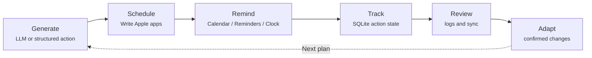

<p align="center">
  <h1 align="center">Nudge</h1>
  <p align="center">
    Local-first macOS automation for plans that actually reach Apple apps
    <br />
    <strong>Plan · Schedule · Remind · Track · Adapt</strong>
    <br />
    <br />
    <a href="README.zh-CN.md">Chinese documentation</a> · <a href="https://github.com/Zenine/nudge/issues">Report Bug</a> · <a href="https://github.com/Zenine/nudge/issues">Request Feature</a>
  </p>
</p>

<p align="center">
  <a href="https://github.com/Zenine/nudge/stargazers"></a>
  <a href="https://www.python.org/"></a>
  <a href="https://github.com/Zenine/nudge/issues"></a>
</p>

<p align="center">
  
</p>

[Chinese documentation](README.zh-CN.md)

Nudge is a local-first macOS CLI runtime that turns structured requests or natural-language plans into Apple Calendar, Reminders, Notes, and Clock actions.

This public repository contains the reusable runtime, CLI, Apple adapters, daemon, MCP wrapper, and installation scripts. Personal plans, local configuration, private state, API keys, Health exports, and user-specific documents are intentionally not included.

## Reader Paths

| If you are | Start with |
|------------|------------|
| Trying Nudge for the first time | [Quick Start](#quick-start) |
| Setting up a Mac | [Installation](#installation), [Configuration](#configuration), [Diagnostics and Repair](#diagnostics-and-repair) |
| Calling Nudge from another AI agent | [Agent and MCP](#agent-and-mcp) |
| Maintaining the project | [Documentation](#documentation), [Development and Verification](#development-and-verification), [Project Layout](#project-layout) |

Rule of thumb: natural-language input goes through `nudge do` or the root command; already-structured actions go through `nudge agent apply` or MCP and skip the LLM.

## Feature Overview

- Parse natural-language plans into calendar events, reminders, notes, and alarms.
- Preview writes with `--dry-run` before touching Apple apps.
- Expose structured Agent JSON and a local MCP stdio server for safe automation.
- Store actions, plans, habits, health summaries, daemon queue rows, and run results in local SQLite.
- Use local adapter contracts for Apple Calendar, Reminders, Notes, and Clock.
- Support Anthropic, OpenAI-compatible APIs, DeepSeek, Qwen/DashScope, and Ollama.

## What It Does



<p align="center">
  
</p>

## Requirements

- macOS.
- Python 3.12+.
- Permissions for Apple Calendar, Reminders, Notes, and Shortcuts.
- At least one usable LLM provider. The default configuration uses Qwen/DashScope.
- To create alarms, a Shortcuts bridge named `Nudge Create Alarm` is required.

## Quick Start

```bash
git clone https://github.com/Zenine/nudge.git nudge-public
cd nudge-public
scripts/bootstrap_mac.sh
nudge doctor
nudge --dry-run "Project sync tomorrow at 3pm"
```

`scripts/bootstrap_mac.sh` creates a project-local `.venv` and initializes `config.toml` from `config.example.toml` when it does not exist.

Recommended operating flow:

1. `nudge doctor` checks config, LLM keys, and Apple permissions.
2. `nudge --dry-run "..."` lets you inspect parsing before any Apple write.
3. `nudge "..."` writes confirmed Calendar / Reminders / Notes / Clock actions.
4. `nudge log ...` records what actually happened.
5. `nudge daily sync --json` reconciles Reminders completions, HealthExport data, and documentation audit results.
6. `nudge review weekly --adapt --dry-run` turns the week into safe adjustment suggestions.
7. `scripts/bootstrap_launchd.sh` optionally automates morning brief, daily sync, evening brief, and the daemon.

## Installation

Use the macOS bootstrap script:

```bash
scripts/bootstrap_mac.sh
```

It creates a project-local `.venv`, installs dependencies, initializes `config.toml` from `config.example.toml` when needed, installs the `nudge` command, and can run `nudge doctor`.

Repository-local entrypoints are also available without adding anything to `PATH`:

```bash
bin/nudge --help
bin/nudge doctor
```

Detailed installation, launchd setup, provider configuration, diagnostics, and runtime logs live in [Setup](docs/SETUP.md).

## Configuration

Nudge reads local settings from `config.toml`. Start from the example:

```bash
cp config.example.toml config.toml
```

Core settings to check:

| Area | Setting |
|------|---------|
| Apple targets | `[general].default_calendar`, `[general].default_reminder_list`, `[general].default_notes_folder` |
| State | `[state].dir` |
| LLM | `[llm].provider`, `[llm].secrets_path`, `[llm.models].fast/default/strong` |
| Clock | `[apple.clock].backend = "shortcuts"`, `[apple.clock].shortcut_name = "Nudge Create Alarm"` |

Secrets are resolved from inline config, provider-specific environment variables, `secrets_path`, then `LLM_API_KEY`. Prefer environment variables or a private `secrets.yaml`; never store secrets in the repository. Supported providers include Qwen/DashScope, OpenAI-compatible APIs, Anthropic, DeepSeek, and Ollama. See [Setup](docs/SETUP.md) for provider snippets and key names.

## Diagnostics and Repair

Run:

```bash
nudge doctor
nudge doctor --json
```

`doctor` checks config, LLM keys, Apple app permissions, configured Calendar/Reminders targets, Notes Automation, and the Clock Shortcuts bridge. Calendar writes and reads may require Full Calendar Access on recent macOS versions. Runtime warnings and actionable errors are written to `<state.dir>/logs/nudge-runtime.jsonl`. Common repair steps and log rotation details are in [Setup](docs/SETUP.md).

## Common Commands

| Goal | Command |
|------|---------|
| Preview natural-language writes | `nudge --dry-run "Project sync tomorrow at 3pm"`; `nudge do --dry-run "Project sync tomorrow at 3pm"` |
| Write after confirming | `nudge "Project sync tomorrow at 3pm"` |
| Read a plan file | `nudge do --file plan.txt --dry-run` |
| Emit stable JSON | `nudge do --json --dry-run "Submit the report tomorrow at 10am"` |
| Generate briefings | `nudge briefing morning`; `nudge briefing evening --notify` |
| Record feedback | `nudge log done "Finished deep work"`; `nudge check-in partial "Half done"` |
| Review and adapt | `nudge review daily`; `nudge review weekly --adapt --dry-run` |
| Sync maintenance | `nudge daily sync --json`; `nudge reminders sync-completed`; `nudge docs audit --json` |
| Backup/export local state | `nudge db backup`; `nudge db export` |

For full CLI contracts, JSON shapes, return codes, automation examples, and troubleshooting, use [CLI](docs/CLI.md).

## Agent and MCP

`nudge agent` is for local automation tools. Callers provide structured JSON; Nudge handles validation, dry-run tokens, Apple writes, and SQLite tracking.

```bash
nudge agent apply --file request.json --dry-run
nudge agent status --file status.json
```

`nudge mcp serve` runs a local stdio MCP server with a deliberately small tool surface:

- `apply_apple_actions`
- `report_action_status`
- `doctor_status`
- `list_nudge_notes`

Start it with:

```bash
nudge mcp serve
```

## Daemon Queue

The daemon queue lets structured requests be enqueued locally and executed by a background process.

```bash
nudge daemon status
nudge daemon health
nudge daemon queue
nudge daemon run
```

launchd management:

```bash
nudge daemon launchd install
nudge daemon launchd start
nudge daemon launchd status
nudge daemon launchd stop
```

`scripts/bootstrap_launchd.sh` installs morning briefing, daily sync, evening briefing, and the headless daemon. Daily sync runs `nudge daily sync --apply --json`; it can create a local documentation maintenance action, but it does not move, delete, or rewrite documentation.

Recovery:

```bash
nudge daemon recover
nudge daemon retry <request-id>
```

## Documentation

- [Docs Index](docs/README.md): public-safe documentation map.
- [Setup](docs/SETUP.md): installation, local configuration, LLM providers, diagnostics, and runtime logs.
- [CLI](docs/CLI.md): command usage, JSON contracts, automation examples, and troubleshooting.
- [Architecture](docs/ARCHITECTURE.md): local-first runtime architecture, data flow, Apple adapters, and MCP placement.
- [Design](docs/DESIGN.md): product interaction principles and workflow constraints.
- [MCP Security](docs/MCP_SECURITY.md): tool surface, capability boundaries, confirmation policy, and client guidance.
- [Daemon Runbook](docs/DAEMON_RUNBOOK.md): daemon health, stale jobs, retry flow, launchd operations, and recovery.
- [Apple Adapter Survey](docs/APPLE_ADAPTER_SURVEY.md): Calendar, Reminders, Notes, Clock, EventKit, AppleScript, and Shortcuts tradeoffs.
- [Module Map](docs/MODULE_MAP.md): source navigation guide for common changes.
- [Skill Spec](docs/SKILL_SPEC.md): deterministic skill format, rule limits, templates, and validation workflow.
- [Prompt Playbook](docs/PROMPT_PLAYBOOK.md): prompt ownership, model tiers, and parsing guardrails.

## Private Data

Keep these outside the public repository:

- `config.toml`
- local SQLite state
- API keys and OAuth tokens
- personal plans and health documents
- Apple Health exports
- app-specific local database snapshots

Secrets are read from environment variables or `config.toml [llm].secrets_path`. The default private path is `~/.config/nudge/secrets.yaml`.

## Development and Verification

Project verification entrypoint:

```bash
scripts/verify.sh
```

It runs:

- `python3 -m pytest tests/ -q`
- `python3 -m compileall -q nudge`
- CLI smoke checks: `nudge --help`, `nudge do --help`, `nudge doctor --help`, `nudge daemon --help`, `nudge mcp --help`

You can also run checks directly:

```bash
python3 -m pytest tests/ -q
python3 -m compileall -q nudge
```

Run the full `scripts/verify.sh` before committing. Do not commit while tests are failing.

## Project Layout

```text
nudge/
  cli.py                 # Click CLI entrypoint
  brain.py               # LLM prompts, parsing, and suggestions
  llm.py                 # LLM provider abstraction and key resolution
  state.py               # SQLite state, actions, habits, health, daemon queue
  apple/                 # Calendar / Reminders / Notes / Clock adapters
  commands/              # CLI subcommands
  skills/                # deterministic Skill Spec engine
scripts/
  bootstrap_mac.sh       # macOS installer
  verify.sh              # project verification entrypoint
config.example.toml      # example configuration
tests/                   # regression tests
```
