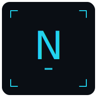

> **语言 / Language**: **简体中文** · [English](README.en.md) · [日本語](README.ja.md) · [繁體中文](README.zh-TW.md)

[](LICENSE)
[](https://github.com/Zenine/nudge/stargazers)
[](https://github.com/Zenine/nudge/commits/main)
[](https://github.com/Zenine/nudge/pulls)
[](https://zenine.github.io/nudge/)
[](https://github.com/lordmos/meridian)

<div align="center">
  
</div>

# Nudge

Nudge 是一个 local-first 的 macOS CLI 运行时，用来把结构化计划或自然语言计划转换为 Apple Calendar、Reminders、Notes 和 Clock 动作。

这个公开仓库只包含可复用运行时、CLI、Apple 适配器、daemon、MCP wrapper 和安装脚本。个人计划、本地配置、私有状态、API key、Health 导出和用户专属文档都应留在私有 overlay 中。

## Quick Start

> 完整文档 → [在线阅读](https://zenine.github.io/nudge/quick-start)

**Step 1** — 获取项目：

```bash
git clone https://github.com/Zenine/nudge.git
cd nudge
```

**Step 2** — 安装并检查本机环境：

```bash
scripts/bootstrap_mac.sh
nudge doctor
```

**Step 3** — 先 dry-run，再写入 Apple 应用：

```bash
nudge --dry-run "Project sync tomorrow at 3pm"
nudge "Project sync tomorrow at 3pm"
```

`scripts/bootstrap_mac.sh` 会创建项目内 `.venv`；使用者不需要手动管理 Python virtual environment。

## Features

- Local-first macOS CLI：在本机解析计划并写入 Calendar、Reminders、Notes 和可选 Clock shortcut。
- Dry-run first：`nudge --dry-run "..."` 先展示解析结果，确认后再实际写入。
- Private overlay：公开 runtime 可以读取私有配置和 SQLite 状态，避免把个人数据放进公开仓库。
- MCP wrapper：`nudge mcp serve` 让 agent 可以通过统一入口访问 Nudge 能力。
- Daily sync：`nudge daily sync --json` 对齐 Reminders 完成状态、HealthExport 数据和文档维护债。
- Review loop：`nudge review weekly --adapt --dry-run` 把一周记录转成安全的调整建议。
- Verification script：`scripts/verify.sh` 覆盖测试、compile、CLI smoke 和只读文档审计。

## Recommended Flow

1. `nudge doctor` 检查配置、LLM key 和 Apple 权限。
2. `nudge --dry-run "..."` 在写入前检查解析结果。
3. `nudge "..."` 写入确认过的 Calendar / Reminders / Notes / Clock 动作。
4. `nudge log ...` 记录实际发生的事。
5. `nudge daily sync --json` 只读同步 Reminders、HealthExport 和文档审计信号。
6. `nudge review weekly --adapt --dry-run` 生成一周复盘和调整建议。
7. `scripts/bootstrap_launchd.sh` 可选安装 morning brief、daily sync、evening brief 和 daemon 自动化。

## Using a Private Overlay

Nudge 可以运行公开 runtime，同时从另一个目录读取私有配置和 SQLite 状态。个人计划、数据库文件、API key 路径、Health 导出和机器专属设置都应放在私有 overlay。

```bash
export NUDGE_CONFIG=/path/to/private/config.toml
export NUDGE_STATE_DIR=/path/to/private/state

bin/nudge doctor
bin/nudge mcp serve
bin/nudge agent status --file /path/to/status.json
```

也可以用顶层 `--config` 为单次命令指定私有配置：

```bash
bin/nudge --config /path/to/private/config.toml doctor
bin/nudge --config /path/to/private/config.toml --dry-run "Project sync tomorrow at 3pm"
```

如果 `NUDGE_CONFIG` 指向私有配置文件，相对的 `[state].dir` 会以该配置文件所在目录为基准解析。显式 `--config /path/to/config.toml` 优先级高于 `NUDGE_CONFIG`。

## Maintenance

```bash
nudge docs audit
nudge docs audit --json
scripts/bootstrap_launchd.sh status
```

`nudge docs audit` 是只读命令。`nudge daily sync --apply --json` 在发现文档错误或 warning 需要处理时，可以创建本地 maintenance action；它不会移动、删除或重写文档。

## Testing and Verification

提交变更前运行仓库验证脚本：

```bash
scripts/verify.sh
```

该脚本会运行公开测试套件、Python compile 检查、CLI smoke checks 和只读文档审计。开发时也可以运行聚焦检查：

```bash
python3 -m pytest tests/ -q
bin/nudge docs audit --json
```

## Private Data

这些内容必须留在公开仓库之外：

- `config.toml`
- local SQLite state
- API keys and OAuth tokens
- personal plans and health documents
- Apple Health exports
- app-specific local database snapshots

密钥优先使用环境变量或 `config.toml [llm].secrets_path` 指向私有文件。不要把密钥、token、数据库或个人机器绝对路径提交到公开仓库。

## License

Nudge 使用 [AGPL-3.0-only](LICENSE) 许可证。

---

<sub>Built with [Meridian](https://github.com/lordmos/meridian) · open-source ops toolkit for Agent projects</sub>
