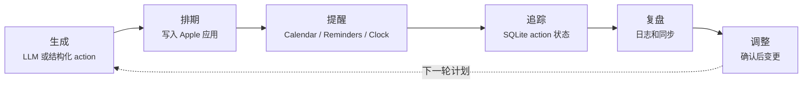

<p align="center">
  <h1 align="center">Nudge</h1>
  <p align="center">
    让计划真正落到 Apple 应用里的 local-first macOS 自动化底座
    <br />
    <strong>规划 · 排期 · 提醒 · 追踪 · 调整</strong>
    <br />
    <br />
    <a href="README.md">English</a> · <a href="https://github.com/Zenine/nudge/issues">报告 Bug</a> · <a href="https://github.com/Zenine/nudge/issues">功能建议</a>
  </p>
</p>

<p align="center">
  <a href="https://github.com/Zenine/nudge/stargazers"></a>
  <a href="https://www.python.org/"></a>
  <a href="https://github.com/Zenine/nudge/issues"></a>
</p>

<p align="center">
  
</p>

[English](README.md)

Nudge 是一个 local-first 的 macOS CLI 底座，用来把结构化请求或自然语言计划转成 Apple Calendar、Reminders、Notes 和 Clock 动作。

这个公共仓库包含可复用 runtime、CLI、Apple adapters、daemon、MCP wrapper 和安装脚本。个人计划、本地配置、私有状态、API keys、健康导出和用户专属文档都不会放进仓库。

## 读者入口

| 如果你是 | 先看 |
|----------|------|
| 第一次试用的人 | [快速开始](#快速开始) |
| 正在配置一台 Mac | [安装](#安装)、[配置](#配置)、[诊断与修复](#诊断与修复) |
| 从其他 AI agent 调用 Nudge | [Agent 与 MCP](#agent-与-mcp) |
| 维护项目的人 | [文档](#文档)、[开发与验证](#开发与验证)、[项目结构](#项目结构) |

一句话判断：自然语言输入走 `nudge do` 或根命令；已经有结构化 action 就走 `nudge agent apply` 或 MCP，跳过 LLM。

## 功能概览

- 把自然语言计划解析成日历事件、提醒事项、笔记和闹钟。
- 提供 `--dry-run` 预览，确认后再写入 Apple 应用。
- 支持结构化 Agent JSON 和本地 MCP stdio server，方便其他 agent 安全调用。
- 使用本地 SQLite 记录 actions、plans、habits、health summaries、daemon queue 和执行结果。
- 支持 Apple Calendar、Reminders、Notes、Clock 的本地 adapter 层。
- 支持 Anthropic、OpenAI-compatible、DeepSeek、Qwen/DashScope、Ollama 等 LLM provider。

## 它做什么



<p align="center">
  
</p>

## 系统要求

- macOS。
- Python 3.12+。
- Apple Calendar / Reminders / Notes / Shortcuts 权限。
- 至少一个可用 LLM provider。默认配置使用 Qwen/DashScope。
- 如果要创建闹钟，需要安装名为 `Nudge Create Alarm` 的 Shortcuts bridge。

## 快速开始

```bash
git clone https://github.com/Zenine/nudge.git nudge-public
cd nudge-public
scripts/bootstrap_mac.sh
nudge doctor
nudge --dry-run "Project sync tomorrow at 3pm"
```

`scripts/bootstrap_mac.sh` 会创建项目内 `.venv`，并在缺少 `config.toml` 时从 `config.example.toml` 初始化配置。

推荐使用流程：

1. `nudge doctor` 检查配置、LLM key 和 Apple 权限。
2. `nudge --dry-run "..."` 先看解析结果，不写 Apple 应用。
3. `nudge "..."` 在确认无误后写入 Calendar / Reminders / Notes / Clock。
4. `nudge log ...` 记录真实完成、跳过、部分完成、延期或阻塞。
5. `nudge daily sync --json` 同步 Reminders 完成状态、HealthExport 汇总和 docs audit 结果。
6. `nudge review weekly --adapt --dry-run` 做周复盘和安全调整建议。
7. 需要自动化时再启用 `scripts/bootstrap_launchd.sh`，让 morning brief、daily sync、evening brief 和 daemon 固定运行。

这个顺序的核心是：**先诊断，再 dry-run，再真实写入；先同步事实，再让复盘调整计划。**

## 安装

推荐使用一键安装脚本：

```bash
scripts/bootstrap_mac.sh
```

脚本会执行这些步骤：

- 检查 Python 版本。
- 创建项目内 `.venv`。
- 安装 `requirements.txt` 里的依赖。
- 如果没有 `config.toml`，从 `config.example.toml` 创建。
- 安装 `nudge` 命令入口。
- 可选运行 `nudge doctor` 做权限和配置检查。

如果不想安装到 PATH，也可以直接用仓库内入口：

```bash
bin/nudge --help
bin/nudge doctor
```

## 配置

先复制示例配置：

```bash
cp config.example.toml config.toml
```

最小配置：

```toml
[general]
default_calendar = "Personal"
default_reminder_list = "Tasks"
locale = "en-US"

[state]
dir = "~/.local/share/nudge"

[llm]
provider = "qwen"
secrets_path = "~/.config/nudge/secrets.yaml"

[llm.models]
fast = "qwen-plus"
default = "qwen-plus"
strong = "qwen-plus"
```

`secrets_path` 应指向部署用户自己的私有文件。默认值是 `~/.config/nudge/secrets.yaml`；也可以用 `NUDGE_SECRETS_PATH` 或 `EMAIL_SECRETS_PATH` 覆盖。不要把任何密钥放进仓库。

密钥优先级：

1. `config.toml [llm].api_key`
2. provider 专用环境变量
3. `secrets_path`
4. `LLM_API_KEY`

长期部署建议用环境变量或 `secrets_path`，不要把 `api_key` 直接写进仓库目录里的文件。

### Apple 默认目标

默认 Apple 写入目标在 `config.toml` 中配置：

```toml
[general]
default_calendar = "Personal"
default_reminder_list = "Tasks"
default_notes_folder = "Nudge"

[apple.clock]
backend = "shortcuts"
shortcut_name = "Nudge Create Alarm"
```

请在目标 Mac 上创建同名 Calendar、Reminders list 和 Notes folder，或把这些值改成已有本地名称。

常见环境变量：

```bash
export DASHSCOPE_API_KEY="<你的 DashScope key>"
export OPENAI_API_KEY="<你的 OpenAI key>"
export ANTHROPIC_API_KEY="<你的 Anthropic key>"
```

`secrets.yaml` 使用简单的顶层 key/value：

```yaml
dashscope_api_key: "<你的 DashScope key>"
openai_api_key: "<你的 OpenAI key>"
anthropic_api_key: "<你的 Anthropic key>"
deepseek_api_key: "<你的 DeepSeek key>"
```

## 大模型配置

Nudge 的 LLM 配置在 `config.toml [llm]` 和 `[llm.models]`。`provider` 决定调用哪类接口，`fast`、`default`、`strong` 可以分别给轻量解析、普通对话和复杂规划使用不同模型。

### Qwen/DashScope

```toml
[llm]
provider = "qwen"
secrets_path = "~/.config/nudge/secrets.yaml"

[llm.models]
fast = "qwen-plus"
default = "qwen-plus"
strong = "qwen-plus"
```

可用密钥位置：

- 环境变量：`DASHSCOPE_API_KEY` 或 `QWEN_API_KEY`
- `secrets.yaml`：`dashscope_api_key` 或 `qwen_api_key`

`provider = "dashscope"` 是 `qwen` 的别名。

### OpenAI

```toml
[llm]
provider = "openai"
secrets_path = "~/.config/nudge/secrets.yaml"

[llm.models]
fast = "gpt-4.1-mini"
default = "gpt-4.1"
strong = "gpt-4.1"
```

可用密钥位置：

- 环境变量：`OPENAI_API_KEY`
- `secrets.yaml`：`openai_api_key`

如需 OpenAI-compatible 网关，可以加 `base_url`：

```toml
[llm]
provider = "openai"
base_url = "https://your-compatible-endpoint/v1"
```

### Anthropic

```toml
[llm]
provider = "anthropic"
secrets_path = "~/.config/nudge/secrets.yaml"

[llm.models]
fast = "claude-haiku-4-5-20251001"
default = "claude-sonnet-4-20250514"
strong = "claude-sonnet-4-20250514"
```

可用密钥位置：

- 环境变量：`ANTHROPIC_API_KEY`
- `secrets.yaml`：`anthropic_api_key`

### DeepSeek

```toml
[llm]
provider = "deepseek"
secrets_path = "~/.config/nudge/secrets.yaml"

[llm.models]
fast = "deepseek-chat"
default = "deepseek-chat"
strong = "deepseek-chat"
```

可用密钥位置：

- 环境变量：`DEEPSEEK_API_KEY`
- `secrets.yaml`：`deepseek_api_key`

### Ollama

Ollama 适合本机离线或内网部署，不需要 API key。先启动 Ollama：

```bash
ollama serve
```

配置示例：

```toml
[llm]
provider = "ollama"
base_url = "http://localhost:11434/v1"

[llm.models]
fast = "llama3.1"
default = "llama3.1"
strong = "llama3.1"
```

## 诊断与修复

先跑诊断：

```bash
nudge doctor
```

输出 JSON 方便脚本读取：

```bash
nudge doctor --json
```

常见问题：

- `Config file not found`：运行 `cp config.example.toml config.toml`，或给命令加 `--config <path>`。
- 找不到 API key：设置 provider 对应环境变量，或在 `config.toml [llm].secrets_path` 指向部署用户自己的 `secrets.yaml`。
- Calendar 权限失败：打开 macOS System Settings -> Privacy & Security -> Calendars，给 Terminal、iTerm、Python 或当前 shell 所在应用授权；如果系统区分访问级别，请选择 Full Calendar Access。
- Reminders 权限失败：打开 System Settings -> Privacy & Security -> Reminders，允许 Terminal、iTerm、Python 或当前运行 Nudge 的应用访问。
- Notes / Mail Automation 权限失败：打开 System Settings -> Privacy & Security -> Automation，允许当前 shell 所在应用控制 Notes 或 Mail。
- 闹钟创建失败：确认 Shortcuts 里存在 `Nudge Create Alarm`，或在 `config.toml [apple.clock].shortcut_name` 改成实际名称。
- `nudge` 命令找不到：先试 `bin/nudge --help`；如果可用，把 `~/.local/bin` 加到 PATH。

## 运行日志

Nudge 会把用户可修复的 warning/error 写入本地 JSONL 运行日志：

```text
<state.dir>/logs/nudge-runtime.jsonl
```

默认 state 目录下路径是：

```text
.nudge/logs/nudge-runtime.jsonl
```

日志记录来自诊断和可操作错误渲染的 WARN/ERROR 事件，用于排障；不会写入 API key 或 provider 原始输出。
每次写入前，Nudge 会在当前文件超过 `runtime_log.max_bytes` 时轮转日志；默认值是 `1048576` 字节。轮转文件保留为同目录下的 `nudge-runtime.jsonl.1` 到 `.3`。

常用查看命令：

```bash
tail -n 50 .nudge/logs/nudge-runtime.jsonl
nudge doctor
nudge doctor --json
```

## 常用命令

自然语言创建动作，先预览：

```bash
nudge --dry-run "明天下午3点开项目同步会，提醒我早上准备材料"
nudge do --dry-run "明天早上8点提醒我跑步"
```

确认无误后真实写入：

```bash
nudge "明天下午3点开项目同步会"
```

从文件读取计划：

```bash
nudge do --file plan.txt --dry-run
```

输出稳定 JSON：

```bash
nudge do "明天10点提醒我交材料" --dry-run --json
```

生成晨间或晚间简报：

```bash
nudge briefing morning
nudge briefing evening --notify
```

记录执行反馈：

```bash
nudge log done "完成了深度工作"
nudge log skipped --reason no_time --next-action reschedule
nudge check-in partial "做了一半，明天继续"
```

查看空闲时间和周期复盘：

```bash
nudge schedule "找2小时深度工作时间"
nudge review daily
nudge review weekly --adapt --dry-run
```

习惯、健康和提醒同步：

```bash
nudge habits --help
nudge health import ~/Downloads/apple_health_export.zip
nudge health daily
nudge daily sync --json
nudge reminders sync-completed
```

自动化和文档维护：

```bash
scripts/bootstrap_launchd.sh status
nudge docs audit
nudge docs audit --json
```

数据库备份：

```bash
nudge db backup
nudge db export
```

## Agent 与 MCP

`nudge agent` 面向本地自动化工具。调用方传入结构化 JSON，Nudge 负责校验、dry-run token、Apple 写入和 SQLite 记录。

```bash
nudge agent apply --file request.json --dry-run
nudge agent status --file status.json
```

`nudge mcp serve` 提供本地 stdio MCP server，暴露有限工具面：

- `apply_apple_actions`
- `report_action_status`
- `doctor_status`
- `list_nudge_notes`

启动方式：

```bash
nudge mcp serve
```

## Daemon 队列

daemon 用于把结构化请求放进本地队列，由后台进程执行 Apple 写入。

```bash
nudge daemon status
nudge daemon health
nudge daemon queue
nudge daemon run
```

launchd 管理：

```bash
nudge daemon launchd install
nudge daemon launchd start
nudge daemon launchd status
nudge daemon launchd stop
```

`scripts/bootstrap_launchd.sh` 会安装 morning briefing、daily sync、evening briefing 和无头 daemon。daily sync 会运行 `nudge daily sync --apply --json`；如果发现文档维护债，只创建本地 maintenance action，不移动、不删除、不重写任何文档。

故障恢复：

```bash
nudge daemon recover
nudge daemon retry <request-id>
```

## 文档

- [文档索引](docs/README.md)：public-safe 文档地图。
- [CLI](docs/CLI.md)：命令用法、JSON contract、自动化示例和排障。
- [Architecture](docs/ARCHITECTURE.md)：local-first runtime 架构、数据流、Apple adapter 和 MCP 位置。
- [Design](docs/DESIGN.md)：产品交互原则和工作流边界。
- [MCP Security](docs/MCP_SECURITY.md)：tool surface、capability 边界、确认策略和 client 指引。
- [Daemon Runbook](docs/DAEMON_RUNBOOK.md)：daemon 健康检查、stale job、retry、launchd 和恢复流程。
- [Apple Adapter Survey](docs/APPLE_ADAPTER_SURVEY.md)：Calendar、Reminders、Notes、Clock、EventKit、AppleScript、Shortcuts 的取舍。
- [Module Map](docs/MODULE_MAP.md)：常见改动的源码导航。
- [Skill Spec](docs/SKILL_SPEC.md)：确定性 skill 格式、规则限制、模板和验证流程。
- [Prompt Playbook](docs/PROMPT_PLAYBOOK.md)：prompt 归属、模型档位和解析护栏。

## 私有数据

这些内容必须保留在公共仓库之外：

- `config.toml`
- 本地 SQLite 状态
- API keys 和 OAuth tokens
- 个人计划和健康文档
- Apple Health 导出
- 应用私有数据库快照

密钥优先通过环境变量或 `config.toml [llm].secrets_path` 读取。默认私有路径是 `~/.config/nudge/secrets.yaml`。

## 开发与验证

项目级验证入口：

```bash
scripts/verify.sh
```

该脚本会运行：

- `python3 -m pytest tests/ -q`
- `python3 -m compileall -q nudge`
- CLI smoke checks：`nudge --help`、`nudge do --help`、`nudge doctor --help`、`nudge daemon --help`、`nudge mcp --help`

也可以单独运行：

```bash
python3 -m pytest tests/ -q
python3 -m compileall -q nudge
```

提交代码前必须跑完整 `scripts/verify.sh`。如果测试失败，不要提交。

## 项目结构

```text
nudge/
  cli.py                 # Click CLI 入口
  brain.py               # LLM prompt、解析和建议
  llm.py                 # LLM provider 抽象与密钥解析
  state.py               # SQLite 状态、actions、habits、health、daemon queue
  apple/                 # Calendar / Reminders / Notes / Clock 适配
  commands/              # CLI 子命令
  skills/                # deterministic Skill Spec 引擎
scripts/
  bootstrap_mac.sh       # macOS 安装脚本
  verify.sh              # 项目验证入口
config.example.toml      # 示例配置
tests/                   # 回归测试
```
