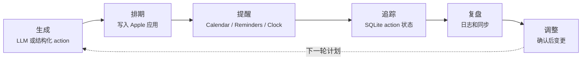

<p align="center">
  <h1 align="center">Nudge</h1>
  <p align="center">
    让计划真正落到 Apple 应用里的 local-first macOS 自动化底座
    <br />
    <strong>规划 · 排期 · 提醒 · 追踪 · 调整</strong>
    <br />
    <br />
    <a href="README.md">English</a> · <a href="https://github.com/Zenine/nudge/issues">报告 Bug</a> · <a href="https://github.com/Zenine/nudge/issues">功能建议</a>
  </p>
</p>

<p align="center">
  <a href="https://github.com/Zenine/nudge/stargazers"></a>
  <a href="https://www.python.org/"></a>
  <a href="https://github.com/Zenine/nudge/issues"></a>
</p>

<p align="center">
  
</p>

[English](README.md)

Nudge 是一个 local-first 的 macOS CLI 底座，用来把结构化请求或自然语言计划转成 Apple Calendar、Reminders、Notes 和 Clock 动作。

这个公共仓库包含可复用 runtime、CLI、Apple adapters、daemon、MCP wrapper 和安装脚本。个人计划、本地配置、私有状态、API keys、健康导出和用户专属文档都不会放进仓库。

## 读者入口

| 如果你是 | 先看 |
|----------|------|
| 第一次试用的人 | [快速开始](#快速开始) |
| 正在配置一台 Mac | [安装](#安装)、[配置](#配置)、[诊断与修复](#诊断与修复) |
| 从其他 AI agent 调用 Nudge | [Agent 与 MCP](#agent-与-mcp) |
| 维护项目的人 | [文档](#文档)、[开发与验证](#开发与验证)、[项目结构](#项目结构) |

一句话判断：自然语言输入走 `nudge do` 或根命令；已经有结构化 action 就走 `nudge agent apply` 或 MCP，跳过 LLM。

## 功能概览

- 把自然语言计划解析成日历事件、提醒事项、笔记和闹钟。
- 提供 `--dry-run` 预览，确认后再写入 Apple 应用。
- 支持结构化 Agent JSON 和本地 MCP stdio server，方便其他 agent 安全调用。
- 使用本地 SQLite 记录 actions、plans、habits、health summaries、daemon queue 和执行结果。
- 支持 Apple Calendar、Reminders、Notes、Clock 的本地 adapter 层。
- 支持 Anthropic、OpenAI-compatible、DeepSeek、Qwen/DashScope、Ollama 等 LLM provider。

## 它做什么



<p align="center">
  
</p>

## 系统要求

- macOS。
- Python 3.12+。
- Apple Calendar / Reminders / Notes / Shortcuts 权限。
- 至少一个可用 LLM provider。默认配置使用 Qwen/DashScope。
- 如果要创建闹钟，需要安装名为 `Nudge Create Alarm` 的 Shortcuts bridge。

## 快速开始

```bash
git clone https://github.com/Zenine/nudge.git nudge-public
cd nudge-public
scripts/bootstrap_mac.sh
nudge doctor
nudge --dry-run "Project sync tomorrow at 3pm"
```

`scripts/bootstrap_mac.sh` 会创建项目内 `.venv`，并在缺少 `config.toml` 时从 `config.example.toml` 初始化配置。

推荐使用流程：

1. `nudge doctor` 检查配置、LLM key 和 Apple 权限。
2. `nudge --dry-run "..."` 先看解析结果，不写 Apple 应用。
3. `nudge "..."` 在确认无误后写入 Calendar / Reminders / Notes / Clock。
4. `nudge log ...` 记录真实完成、跳过、部分完成、延期或阻塞。
5. `nudge daily sync --json` 同步 Reminders 完成状态、HealthExport 汇总和 docs audit 结果。
6. `nudge review weekly --adapt --dry-run` 做周复盘和安全调整建议。
7. 需要自动化时再启用 `scripts/bootstrap_launchd.sh`，让 morning brief、daily sync、evening brief 和 daemon 固定运行。

这个顺序的核心是：**先诊断，再 dry-run，再真实写入；先同步事实，再让复盘调整计划。**

## 安装

推荐使用一键安装脚本：

```bash
scripts/bootstrap_mac.sh
```

脚本会创建项目内 `.venv`、安装依赖、在缺少本地配置时从 `config.example.toml` 初始化 `config.toml`、安装 `nudge` 命令，并可选运行 `nudge doctor`。

如果不想安装到 PATH，也可以直接用仓库内入口：

```bash
bin/nudge --help
bin/nudge doctor
```

更完整的安装、launchd 配置、provider 配置、诊断和运行日志说明见 [安装、配置与排障](docs/SETUP.md)。

## 配置

Nudge 从本地 `config.toml` 读取设置。先复制示例配置：

```bash
cp config.example.toml config.toml
```

重点检查这些配置：

| 范围 | 配置 |
|------|------|
| Apple 目标 | `[general].default_calendar`、`[general].default_reminder_list`、`[general].default_notes_folder` |
| 状态目录 | `[state].dir` |
| LLM | `[llm].provider`、`[llm].secrets_path`、`[llm.models].fast/default/strong` |
| Clock | `[apple.clock].backend = "shortcuts"`、`[apple.clock].shortcut_name = "Nudge Create Alarm"` |

密钥按内联配置、provider 专用环境变量、`secrets_path`、`LLM_API_KEY` 的顺序解析。长期部署优先用环境变量或私有 `secrets.yaml`；不要把密钥放进仓库。支持的 provider 包括 Qwen/DashScope、OpenAI-compatible API、Anthropic、DeepSeek 和 Ollama。provider 片段和 key 名称见 [安装、配置与排障](docs/SETUP.md)。

## 诊断与修复

运行：

```bash
nudge doctor
nudge doctor --json
```

`doctor` 会检查配置、LLM key、Apple 应用权限、配置的 Calendar/Reminders 目标、Notes Automation 自动化权限和 Clock Shortcuts bridge。较新的 macOS 上，Calendar 写入和读取可能需要 Full Calendar Access。运行时 warning 和可操作错误会写入 `<state.dir>/logs/nudge-runtime.jsonl`。常见修复步骤和日志轮转细节见 [安装、配置与排障](docs/SETUP.md)。

## 常用命令

| 目标 | 命令 |
|------|------|
| 预览自然语言写入 | `nudge --dry-run "明天下午3点开项目同步会"`；`nudge do --dry-run "明天下午3点开项目同步会"` |
| 确认后真实写入 | `nudge "明天下午3点开项目同步会"` |
| 从文件读取计划 | `nudge do --file plan.txt --dry-run` |
| 输出稳定 JSON | `nudge do --json --dry-run "明天10点提醒我交材料"` |
| 生成简报 | `nudge briefing morning`；`nudge briefing evening --notify` |
| 记录执行反馈 | `nudge log done "完成了深度工作"`；`nudge check-in partial "做了一半"` |
| 复盘和调整 | `nudge review daily`；`nudge review weekly --adapt --dry-run` |
| 同步维护 | `nudge daily sync --json`；`nudge reminders sync-completed`；`nudge docs audit --json` |
| 备份/导出本地状态 | `nudge db backup`；`nudge db export` |

完整 CLI 契约、JSON 结构、返回码、自动化示例和排障见 [CLI](docs/CLI.md)。

## Agent 与 MCP

`nudge agent` 面向本地自动化工具。调用方传入结构化 JSON，Nudge 负责校验、dry-run token、Apple 写入和 SQLite 记录。

```bash
nudge agent apply --file request.json --dry-run
nudge agent status --file status.json
nudge agent status --config /path/to/config.toml --file status.json
```

如果 action 是用自定义 `[state].dir` 创建的，状态回写也应传入同一个 `--config`。

`nudge mcp serve` 提供本地 stdio MCP server，暴露有限工具面：

- `apply_apple_actions`
- `report_action_status`
- `doctor_status`
- `list_nudge_notes`

启动方式：

```bash
nudge mcp serve
nudge mcp serve --config /path/to/config.toml
```

使用 `--config` 启动时，MCP 写入工具和 `report_action_status` 会使用该配置的 `[state].dir` 保存 SQLite 状态和确认 token。

## Daemon 队列

daemon 用于把结构化请求放进本地队列，由后台进程执行 Apple 写入。

```bash
nudge daemon status
nudge daemon health
nudge daemon queue
nudge daemon run
```

launchd 管理：

```bash
nudge daemon launchd install
nudge daemon launchd start
nudge daemon launchd status
nudge daemon launchd stop
```

`scripts/bootstrap_launchd.sh` 会安装 morning briefing、daily sync、evening briefing 和无头 daemon。daily sync 会运行 `nudge daily sync --apply --json`；如果发现文档维护债，只创建本地 maintenance action，不移动、不删除、不重写任何文档。

故障恢复：

```bash
nudge daemon recover
nudge daemon retry <request-id>
```

## 文档

- [文档索引](docs/README.md)：public-safe 文档地图。
- [安装、配置与排障](docs/SETUP.md)：安装、本地配置、LLM provider、诊断和运行日志。
- [CLI](docs/CLI.md)：命令用法、JSON contract、自动化示例和排障。
- [Architecture](docs/ARCHITECTURE.md)：local-first runtime 架构、数据流、Apple adapter 和 MCP 位置。
- [Design](docs/DESIGN.md)：产品交互原则和工作流边界。
- [MCP Security](docs/MCP_SECURITY.md)：tool surface、capability 边界、确认策略和 client 指引。
- [Daemon Runbook](docs/DAEMON_RUNBOOK.md)：daemon 健康检查、stale job、retry、launchd 和恢复流程。
- [Apple Adapter Survey](docs/APPLE_ADAPTER_SURVEY.md)：Calendar、Reminders、Notes、Clock、EventKit、AppleScript、Shortcuts 的取舍。
- [Module Map](docs/MODULE_MAP.md)：常见改动的源码导航。
- [Skill Spec](docs/SKILL_SPEC.md)：确定性 skill 格式、规则限制、模板和验证流程。
- [Prompt Playbook](docs/PROMPT_PLAYBOOK.md)：prompt 归属、模型档位和解析护栏。

## 私有数据

这些内容必须保留在公共仓库之外：

- `config.toml`
- 本地 SQLite 状态
- API keys 和 OAuth tokens
- 个人计划和健康文档
- Apple Health 导出
- 应用私有数据库快照

密钥优先通过环境变量或 `config.toml [llm].secrets_path` 读取。默认私有路径是 `~/.config/nudge/secrets.yaml`。

## 开发与验证

项目级验证入口：

```bash
scripts/verify.sh
```

该脚本会运行：

- `python3 -m pytest tests/ -q`
- `python3 -m compileall -q nudge`
- CLI smoke checks：`nudge --help`、`nudge do --help`、`nudge doctor --help`、`nudge daemon --help`、`nudge mcp --help`

也可以单独运行：

```bash
python3 -m pytest tests/ -q
python3 -m compileall -q nudge
```

提交代码前必须跑完整 `scripts/verify.sh`。如果测试失败，不要提交。

## 项目结构

```text
nudge/
  cli.py                 # Click CLI 入口
  brain.py               # LLM prompt、解析和建议
  llm.py                 # LLM provider 抽象与密钥解析
  state.py               # SQLite 状态、actions、habits、health、daemon queue
  apple/                 # Calendar / Reminders / Notes / Clock 适配
  commands/              # CLI 子命令
  skills/                # deterministic Skill Spec 引擎
scripts/
  bootstrap_mac.sh       # macOS 安装脚本
  verify.sh              # 项目验证入口
config.example.toml      # 示例配置
tests/                   # 回归测试
```
