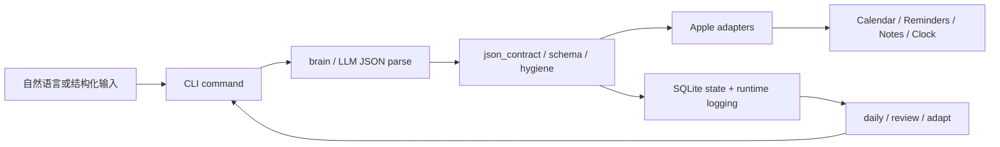
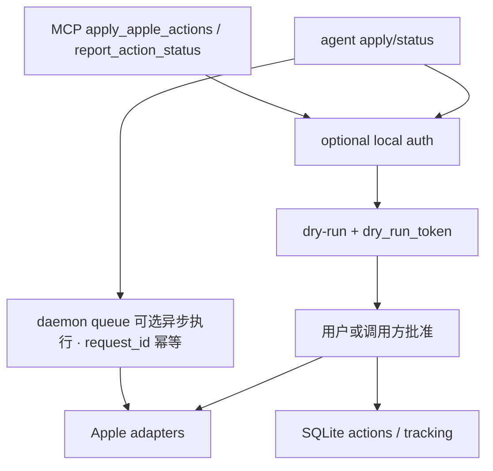
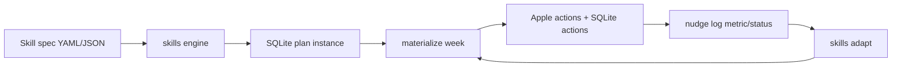

# 架构与数据流

Nudge 是一个 local-first 的 macOS CLI：把自然语言或结构化计划转成 Apple Calendar、Reminders、Notes 和 Clock 动作，并把执行状态保存在本机 SQLite。公开仓库只包含可复用 runtime、CLI、Apple adapters、daemon、MCP wrapper、Skills/trainer runtime 与安装脚本；私人计划、个人配置、API key、健康导出、本机 SQLite 状态和用户专属资料不属于公开仓库内容。

本文面向贡献者和外部用户，帮助理解 runtime 如何串联。完整命令入口见 [`docs/commands.md`](commands.md)，配置与安全默认值见 [`docs/configuration.md`](configuration.md) 和 [`SECURITY.md`](../SECURITY.md)。

## 总览



高层分层：

- `nudge/cli.py` 注册 Click CLI，并把未知裸文本路由到 `nudge do`。
- `nudge/commands/*` 是用户可见命令层，负责读配置、解析参数、选择 dry-run 或真实写入。
- `nudge/brain.py` 负责 LLM 调用和 JSON 提取；`nudge/json_contract.py`、命令内 schema 检查和 `nudge/action_hygiene.py` 负责稳定输出契约与轻量规范化。
- `nudge/apple/*` 是 Apple App 边界，隐藏 AppleScript、EventKit、Shortcuts 等后端差异。
- `nudge/state.py` 管理本机 SQLite：计划、动作、健康汇总、习惯、daemon 队列（含 `request_id` 幂等主键）和运行记录。

## 核心自然语言数据流

常见路径是 `nudge --dry-run "..."` 或 `nudge "..."`：

1. `nudge/cli.py` 判断首个参数不是已知子命令时，自动转成 `do` 命令。
2. `nudge/commands/do.py` 读取配置、默认日历/提醒列表、家庭路由和 Apple backend。
3. `nudge/brain.py` 把自然语言解析为 JSON actions；解析层会处理 fenced JSON、前后说明文字和 JSON object/list 提取。
4. `do` 命令执行 schema/value 检查，给 CLI JSON 输出加 `schema_version`，并对提醒标题做轻量 hygiene。
5. dry-run 只展示计划，不写 Apple；真实执行调用 `nudge/apple/adapters.py` 解析出的 Calendar、Reminders、Notes、Clock backend。
6. 写入成功或失败的动作会记录到 SQLite，供 `log`、`daily`、`review`、`skills adapt` 和 daemon 状态查询使用。

核心契约很小：action 通常是 `calendar_event`、`reminder`、`note` 或 `alarm`，并带各自必需字段。命令层负责把这些 action 转成具体 Apple 写入调用，而不是让 LLM 直接调用 Apple App。

## 结构化 agent / MCP / daemon 数据流

结构化入口用于其他本地 agent 或 MCP client 代表用户发起动作。



关键关系：

- `nudge agent apply` 读取结构化请求，执行与 `do` 相同的 action schema 检查和 Apple 写入路径。
- MCP `apply_apple_actions` 是 JSON-RPC stdio tool surface，内部复用 agent apply；`report_action_status` 复用 agent status，把外部执行结果写回 SQLite。
- `agent apply` / MCP 写入接受可选 `request_id` 作为调用方 trace；直连路径不再按 `request_id` 做 replay 去重（历史机制已移除）。异步执行时，`daemon enqueue` 以 `request_id` 作为队列幂等键（`command_queue` 主键），避免重复入队。
- dry-run 会返回 `dry_run_token`。真实写入时保留已批准 payload 和 token，可防止“预览后 payload 被替换”。
- `[security.local_auth]` 默认关闭；启用后，`agent apply/status`、MCP `apply_apple_actions/report_action_status` 需要 `auth_token`，在 Apple 写入或状态更新前校验。
- daemon queue 把 `agent.apply` 类请求写入 SQLite 队列，由 `nudge daemon run` claim、执行、记录成功/失败和 stale retry。队列仍依赖 `request_id` 幂等，不绕过 agent 安全契约。

## Skills / trainer 数据流

Skills 是确定性计划模板 runtime，trainer 是面向健身的兼容入口。



流程要点：

1. `nudge/skills/schema.py` 定义 Skill spec 形状；内置 spec 位于 `nudge/skills/builtins/`。
2. `nudge/skills/engine.py`、`jsonlogic.py`、`patch.py` 和 `dryrun.py` 根据 context 生成候选 plans/actions。
3. `nudge skills start <skill-id>` 创建 SQLite plan instance，并 materialize 首批 week actions；`--dry-run` 只预览。
4. materialize 阶段复用 Apple-safe runtime：真实写 Calendar/Reminders，并把 actions 记录到 SQLite。
5. `nudge log done --metric effort=8` 等命令把真实完成情况和指标写回 SQLite。
6. `nudge skills adapt <plan-id>` 读取 plan config 和已记录 actions/metrics，预览下一阶段；只有 `--apply` 才 materialize 后续 week 并推进 cursor。
7. `nudge trainer plan` 默认使用内置 strength Skill runtime；旧 LLM planner 仅作为显式兼容路径保留。

## Health / daily / review 数据流

这些命令主要读写 SQLite，不直接创建新的 Apple 项。

- `nudge health import` 解析 Apple Health export ZIP 或 HealthExport JSON。XML 解析使用 `defusedxml`，并对导入范围与大小做防护；默认 dry-run，`--apply` 才把 daily summary、workouts 和 import metadata 写入 SQLite。
- `nudge reminders sync-completed` 读取 Apple Reminders 和 SQLite actions，把已经在 Apple 侧完成的提醒同步为本地 action 状态。
- `nudge daily sync` 汇总 Health 导入、Reminders completion、文档审计和 pending/overdue actions。默认预览；`--apply` 可以写入本地维护 action 或同步状态。
- `nudge review daily|weekly` 读取 actions、habit streaks 和近期状态生成复盘。`--adapt --dry-run` 只输出建议；`--adapt --apply` 才可能把安全适配计划写入 Calendar 或本地状态。

这些路径的设计目标是：外部数据先安全解析，进入 SQLite 后再由 daily/review/adapt 做汇总和建议，避免复盘命令直接依赖原始私密导出文件。

## 本地状态边界

SQLite 是 Nudge runtime 的事实状态源，包含：

- `plans` / `actions`：Skill/trainer/do/agent 生成的计划与动作。
- `habit_logs`、`evaluations`、`chat_history`：习惯、评估和对话历史。
- `health_imports`、`health_daily_summary`、`health_workouts`：健康导入摘要。
- `command_queue`、`daemon_runs`：daemon 队列（`request_id` 幂等主键）与执行记录。
- `state_migrations`：legacy JSON state 迁移状态。

状态目录由 `NUDGE_STATE_DIR` 或配置 `[state].dir` 决定。公开仓库不应包含本机 SQLite、legacy state、`config.toml`、API key/OAuth token、Apple Health 原始导出、真实日历/提醒/备忘录内容、个人计划或 app database snapshot。legacy JSON 迁移只在本机状态目录内进行，不应把旧状态文件纳入公开仓库。

## Apple adapter 边界

`nudge/apple/adapters.py` 定义了 Calendar、Reminders、Notes、Clock 的 backend protocol，并把命令层与具体实现隔离：

- Calendar：创建事件、列出日历；当前以项目内 native 路径为主。
- Reminders：创建提醒、列出列表、探测读取权限；包含 EventKit 快路径和 AppleScript fallback/write path。
- Notes：窄写入 surface，用于创建备忘录。
- Clock：通过 Shortcuts bridge 创建闹钟。

所有真实写入都应经过命令层确认或结构化 dry-run。dry-run 不创建 Apple 项；真实写入需要 macOS、对应 App 可用，并已授予 Calendar/Reminders/Notes/Shortcuts/Automation 等权限。`nudge doctor` 可用于检查常见权限和 backend 配置问题。

## 安全边界

Nudge 的信任模型是 local-first：默认信任能够以同一用户身份调用 CLI、写 stdin 或连接本地 MCP client 的本地进程。安全控制重点是减少误写、重复写和隐藏 payload 变更，而不是替代 OS 级隔离。

主要边界：

- 本地认证：`[security.local_auth]` 可保护 agent/MCP mutating tools；见 [`SECURITY.md`](../SECURITY.md)。
- 幂等：`daemon enqueue` 以 `request_id` 作为队列幂等键（`command_queue` 主键），避免异步 retry 重复入队；agent/MCP 直连写入不做 replay 去重，依赖 dry-run + 调用方保留已批准 payload。
- dry-run token：把用户批准的 dry-run payload 与真实写入绑定。
- JSON/schema/hygiene：LLM 输出先转成受限 action JSON，再由命令层检查，Apple adapter 不直接接受任意 LLM 文本。
- Health XML：使用 `defusedxml` 解析，并只建议导入用户本人可信导出。
- Secret handling：公开仓库不提交 secrets；配置参考建议用环境变量或私有 secrets 文件，详见 [`docs/configuration.md`](configuration.md)。

如果要在共享、远程、多用户或不可信环境中运行，需要自行增加 OS 用户隔离、文件权限、进程沙箱、网络限制和 secret management；不要把本地写入入口暴露给不可信调用方。

## 贡献者导航

常见改动入口：

- CLI 注册与裸文本路由：`nudge/cli.py`
- 用户命令：`nudge/commands/*`
- 自然语言解析与 LLM JSON 提取：`nudge/brain.py`
- CLI JSON contract：`nudge/json_contract.py`
- action hygiene：`nudge/action_hygiene.py`
- 配置读取与默认值：`nudge/config.py`
- SQLite schema、迁移、actions、health、queue、幂等：`nudge/state.py`
- Apple backend 边界：`nudge/apple/adapters.py`
- Apple App 具体实现：`nudge/apple/calendar.py`、`nudge/apple/reminders.py`、`nudge/apple/notes.py`、`nudge/apple/clock.py`
- Skills spec/runtime：`nudge/skills/*` 与 `nudge/skills/builtins/*`
- Health import：`nudge/health.py`
- Daily/review/failures 汇总：`nudge/commands/daily.py`、`nudge/commands/review.py`、`nudge/failures.py`
- MCP wrapper：`nudge/commands/mcp.py`
- agent apply/status：`nudge/commands/agent.py`
- daemon queue/runtime：`nudge/commands/daemon.py`
- 测试：`tests/test_*.py`

贡献前建议先运行：

```bash
bin/nudge docs audit --json
python -m pytest tests/test_verify_script.py -q
```

涉及 runtime 或安全边界的改动，优先补纯函数/CLI 单测，再运行 `scripts/verify.sh`。
